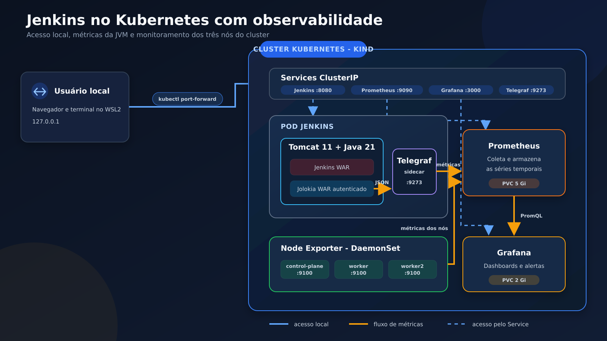
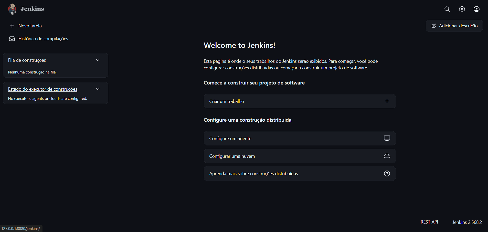
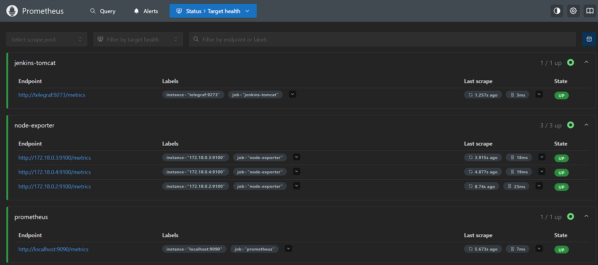
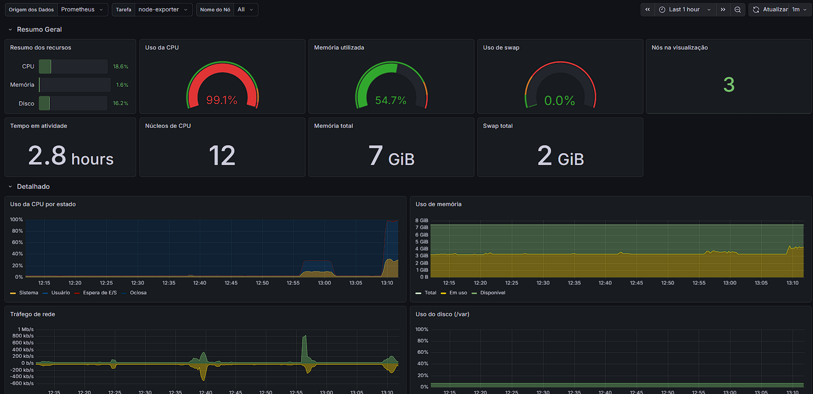
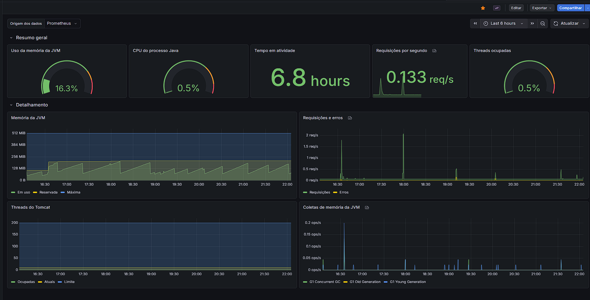
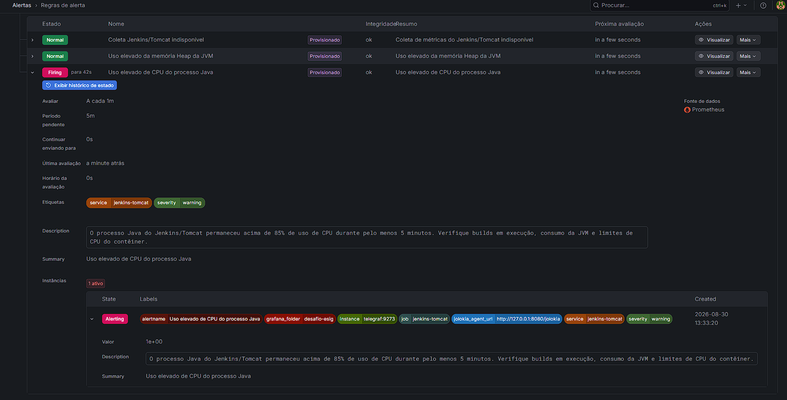

# Jenkins no Kubernetes com observabilidade

Projeto desenvolvido para executar o Jenkins em um servidor Apache Tomcat dentro de um cluster Kubernetes local. O ambiente também disponibiliza métricas da JVM por meio do Jolokia, converte essas métricas para o formato do Prometheus com o Telegraf e apresenta os dados no Grafana.

Além do monitoramento da aplicação, cada nó do cluster é monitorado pelo Node Exporter.

## Objetivos

- Executar o Jenkins como arquivo WAR no Apache Tomcat.
- Disponibilizar e proteger o endpoint do Jolokia.
- Executar a aplicação em um cluster Kubernetes criado com Kind.
- Coletar métricas da JVM e dos nós do cluster com Prometheus.
- Visualizar as métricas e os alertas no Grafana.
- Persistir os dados principais do Jenkins, Prometheus e Grafana.
- Automatizar a implantação, o acesso e a validação do ambiente.

## Arquitetura



O Jenkins e o Telegraf são executados no mesmo Pod. O Telegraf atua como *sidecar*: consulta o endpoint local e autenticado do Jolokia e publica as métricas no formato aceito pelo Prometheus.

O fluxo das métricas da aplicação é:

```text
JVM/Tomcat -> Jolokia -> Telegraf -> Prometheus -> Grafana
```

O Jolokia fornece dados JMX em JSON. Como o Prometheus não coleta esse formato diretamente, o Telegraf faz a leitura e a conversão para o formato de métricas do Prometheus.

O Node Exporter é implantado como `DaemonSet`. Dessa forma, o Kubernetes mantém uma instância do exporter em cada nó do cluster.

## Tecnologias utilizadas

| Componente | Versão usada | Função no projeto |
|---|---:|---|
| Apache Tomcat | 11.0.25 | Servidor de aplicação do Jenkins e do Jolokia |
| Java | 21 | Ambiente de execução da JVM |
| Jenkins | 2.568.2 | Servidor de automação |
| Jolokia | 2.6.1 | Acesso HTTP às informações JMX da JVM |
| Telegraf | 1.39.3 | Conversão das métricas do Jolokia |
| Kubernetes | 1.37.0 | Orquestração dos containers |
| Kind | 0.33.0 | Cluster Kubernetes local em containers Docker |
| Kustomize | 5.8.1 | Organização e aplicação dos manifestos |
| Prometheus | 3.13.2 | Coleta e armazenamento de métricas |
| Node Exporter | 1.12.1 | Métricas dos nós do cluster |
| Grafana | 12.4.9 | Dashboards e regras de alerta |

## Pré-requisitos

O projeto foi desenvolvido no Windows com Ubuntu no WSL2. Os comandos devem ser executados no terminal do Linux/WSL.

Antes de iniciar, devem estar disponíveis:

- Docker Engine;
- Git;
- cURL;
- kubectl;
- Kind;
- jq.

## Instalação

### 1. Clonar o repositório

```bash
git clone https://github.com/kakanetwork/projeto-jenkins-kubernetes-esig.git
cd projeto-jenkins-kubernetes-esig
```

### 2. Criar as configurações locais

Copie os exemplos de configuração:

```bash
cp kubernetes/jenkins/.env.example kubernetes/jenkins/.env
cp kubernetes/grafana/.env.example kubernetes/grafana/.env
```

Edite as credenciais do Jolokia e do Grafana conforme orienta o arquivo.
O Kustomize irá utiliza-los para gerar os objetos `Secret` aplicados no cluster.

### 3. Permitir a execução dos scripts

```bash
chmod +x scripts/*.sh
```

### 4. Implantar o ambiente

```bash
./scripts/deploy.sh
```

O script executa as seguintes tarefas:

1. baixa os arquivos WAR do Jenkins e do Jolokia, caso ainda não existam;
2. constrói a imagem `desafio-esig/jenkins-tomcat`;
3. cria o cluster Kind `desafio-esig` ou reutiliza o cluster existente;
4. carrega a imagem local nos nós do Kind;
5. aplica os manifestos com Kustomize;
6. reinicia o Deployment do Jenkins para utilizar a imagem construída;
7. aguarda a disponibilização dos componentes.

## Primeiro acesso ao Jenkins

Em uma instalação nova, obtenha a senha inicial com:

```bash
kubectl exec \
  -n desafio-esig \
  deploy/jenkins \
  -c jenkins-tomcat \
  -- cat /root/.jenkins/secrets/initialAdminPassword
```

Depois, acesse o Jenkins, informe a senha inicial, instale as extensões sugeridas e crie o primeiro usuário administrativo.
As configurações realizadas no Jenkins são mantidas no PVC `jenkins-data`.

### Jenkins em execução



*Jenkins publicado pelo Tomcat e acessível no ambiente local.*

## Acesso aos serviços

Execute:

```bash
./scripts/access.sh
```

O terminal ficará ocupado enquanto os redirecionamentos estiverem ativos. Use outro terminal para executar comandos de validação. Para encerrar os acessos, pressione `Ctrl+C`.

| Serviço | Endereço local |
|---|---|
| Jenkins | http://127.0.0.1:8080/jenkins |
| Jolokia | http://127.0.0.1:8080/jolokia |
| Prometheus | http://127.0.0.1:9090 |
| Grafana | http://127.0.0.1:3000 |

O script usa `kubectl port-forward` e vincula os acessos ao endereço local `127.0.0.1`.

## Validação do ambiente

Com `access.sh` em execução, abra outro terminal na raiz do projeto e execute:

```bash
./scripts/verify.sh
```

O script valida:

- contexto correto do Kubernetes;
- disponibilidade dos Deployments e do DaemonSet;
- estado dos volumes persistentes;
- resposta do Jenkins;
- bloqueio do Jolokia sem credenciais;
- acesso do Jolokia com credenciais;
- saúde do Prometheus;
- coleta das métricas da JVM;
- três instâncias ativas do Node Exporter;
- saúde do Grafana;
- provisionamento dos dashboards e das regras de alerta.

Após uma atualização do Jenkins, a primeira coleta da JVM pode levar alguns segundos. A verificação aguarda a métrica durante até 60 segundos antes de informar erro.

## Monitoramento

### Prometheus

O Prometheus coleta quatro grupos de métricas:

- métricas do próprio Prometheus;
- métricas JVM/Tomcat expostas pelo Telegraf;
- métricas de cada instância do Node Exporter;
- estado dos alvos configurados.

Os alvos podem ser consultados em:

```text
http://127.0.0.1:9090/targets
```

### Alvos do Prometheus



*Coleta ativa das métricas da JVM e dos três nós do cluster.*

### Grafana

O datasource do Prometheus é criado automaticamente. Também são provisionados dois dashboards:

- **Infraestrutura Kubernetes - Node Exporter**: visão consolidada e individual dos nós, com CPU, memória, swap, rede, disco e tempo em atividade;
- **Jenkins/Tomcat JVM**: uso de heap, CPU da JVM, threads e requisições do Tomcat.

Os dashboards ficam versionados como JSON em `kubernetes/grafana/dashboards/`.

### Regras de alerta

| Alerta | Condição | Período | Severidade |
|---|---|---:|---|
| Coleta Jenkins/Tomcat indisponível | métrica de uptime da JVM ausente | 2 minutos | critical |
| Uso elevado do heap | heap da JVM acima de 80% | 5 minutos | warning |
| CPU elevada da JVM | CPU do processo JVM acima de 85% | 5 minutos | warning |

As regras são provisionadas pelo arquivo `kubernetes/grafana/provisioning/alerting/alert-rules.yaml`. Elas podem ser acompanhadas na área **Alertas > Regras de alerta** do Grafana.

Não foi configurado um canal externo de notificação. As regras permanecem disponíveis no Grafana, permitindo que o canal adequado seja definido conforme o ambiente.

### Dashboard de infraestrutura



*Visão consolidada de CPU, memória, disco e rede dos nós Kubernetes.*

### Dashboard de monitoramento do Jenkins, Tomcat e JVM

O dashboard apresenta as principais métricas da aplicação, incluindo uso de CPU da JVM, memória heap e non-heap, garbage collection, threads e informações do Tomcat.



### Validação dos alertas



*Alerta disparado durante o teste controlado de carga na JVM.*

## Persistência

| PVC | Capacidade | Dados mantidos |
|---|---:|---|
| `jenkins-data` | 5 Gi | configurações, usuários, extensões e trabalhos do Jenkins |
| `prometheus-data` | 5 Gi | séries temporais coletadas pelo Prometheus |
| `grafana-data` | 2 Gi | banco interno e configurações do Grafana |

## Decisões de segurança e configuração

- O endpoint do Jolokia exige autenticação HTTP Basic.
- As credenciais são fornecidas ao Kubernetes por objetos `Secret` gerados pelo Kustomize.
- Os Services são do tipo `ClusterIP` e não publicam diretamente as aplicações fora do cluster.
- O acesso local é vinculado a `127.0.0.1`.
- Os containers possuem `requests` e `limits` de CPU e memória.
- O Grafana não monta automaticamente o token da ServiceAccount.
- Os arquivos de configuração são montados como somente leitura quando não precisam ser alterados pelo container.
- Os dados das aplicações são armazenados em volumes persistentes.

## Teste opcional de carga

O script de carga não é executado durante a implantação ou a validação. Ele deve ser chamado manualmente e apenas durante uma demonstração controlada.

Para gerar carga de infraestrutura durante 300 segundos:

```bash
./test/teste_carga.sh infra 300
```

Para remover o Pod de carga da infraestrutura antes do término:

```bash
./teste/teste_carga.sh stop
```

## Encerramento

Para encerrar apenas os acessos locais, pressione `Ctrl+C` no terminal do `access.sh`. Os componentes continuarão executando no cluster.

## Resultado

O ambiente final executa Jenkins no Tomcat dentro do Kubernetes, mantém o Jolokia protegido, coleta métricas da JVM e dos três nós do cluster, persiste os dados principais e provisiona automaticamente dashboards e alertas. A implantação e a validação podem ser reproduzidas pelos scripts disponíveis no repositório.
